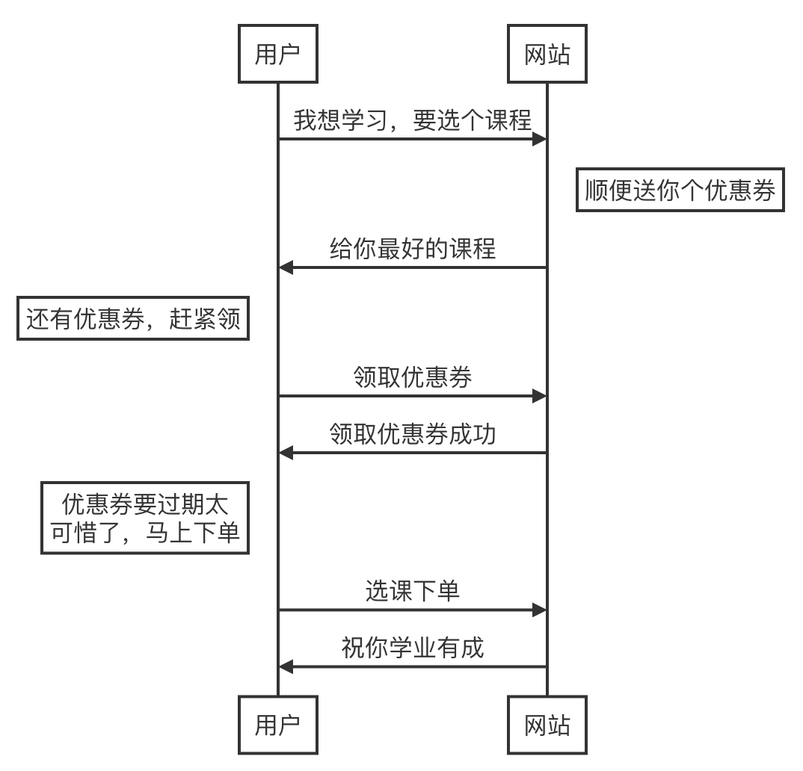

# spring-cloud-alibaba
微服务领域后起之秀Spring Cloud Alibaba。
此项目将介绍Spring Cloud各组件与Spring Cloud Alibaba整合运用。

# distributedSystem


## 业务模型

本工程类似慕课网这样的一个在`线售课商城`，我们采用这个案例主要是大家对这个网站都比较熟悉，然后我们从它的核心功能中，抽象出一个比较`简单的业务模型`，以及一些`常见的业务场景`。

> 我们抽象出来的这个业务模型，它主要有四个业务模块，包括`用户、商品、订单、优惠券`，然后我们最主要的业务流程就是用户挑选商品，也就是商城上的课程，还可以领优惠券，然后选完商品后就可以下单，下单的时候也可以使用优惠券，主要是这样一个流程。



## 数据库表设计

### 用户表

```sql
create table `t_user` (
  `id` bigint unsigned auto_increment comment '主键',
  `account` varchar(32) not null comment '账号',
  `name` varchar(126) default '' comment '姓名',
  `password` varchar(128) default '' comment '密码',
  `role` tinyint unsigned default 1 comment '角色 1-普通用户 2-讲师',
  `status` tinyint unsigned default 0 comment '状态 0-锁定 1-正常',
  `create_time` datetime default current_timestamp comment '创建时间',
  `update_time` datetime default current_timestamp on update 
                                 current_timestamp comment '更新时间',
  primary key pk_id (`id`),
  unique key uk_account(`account`)
) engine=innodb default charset=utf8mb4 collate=utf8mb4_unicode_ci comment='用户表';
```

### 商品表

```sql
create table `t_goods` (
  `id` bigint unsigned auto_increment comment '主键',
  `name` varchar(100) not null comment '商品名称',
  `description` varchar(1000) default '' comment '商品描述',  
  `type` tinyint unsigned default 0 comment '商品类型 1-免费课 2-实战课 3-体系课',
  `price` decimal(10, 2) not null comment '商品价格',
  `stock` bigint default -1 comment '商品库存，-1代表没有库存限制',
  `create_time` datetime default current_timestamp comment '创建时间',
  `update_time` datetime default current_timestamp on update 
                                 current_timestamp comment '更新时间',
  primary key pk_id (`id`)
) engine=innodb default charset=utf8mb4 collate=utf8mb4_unicode_ci comment='商品表';
```

### 订单（父表）

```sql
create table `t_order` (
  `id` bigint unsigned auto_increment comment '主键',
  `order_no` bigint unsigned not null comment '订单号',
  `amount` decimal(10, 2) not null comment '总金额',
  `status` tinyint unsigned default 0 comment '状态 0-初始化 1-提交 2-完成 3-撤销',
  `user_id` bigint unsigned not null comment '用户ID',
  `coupon_record_id` bigint unsigned default null comment '优惠券ID',
  `create_time` datetime default current_timestamp comment '创建时间',
  `update_time` datetime default current_timestamp on update 
  															 current_timestamp comment '更新时间',
  primary key pk_id (`id`),
  unique key uk_order_no(`order_no`),
  index idx_user_id(`user_id`)
) engine=innodb default charset=utf8mb4 collate=utf8mb4_unicode_ci comment='订单表';
```

### 订单（子表）

```sql
create table `t_order_item` (
  `id` bigint unsigned auto_increment comment '主键',
  `order_no` bigint unsigned not null comment '订单号',
  `goods_id` bigint unsigned not null comment '商品ID',
  `number` int unsigned default 1 comment '数量',
  `amount` decimal(10, 2) default null comment '总金额',
  `create_time` datetime default current_timestamp comment '创建时间',
  `update_time` datetime default current_timestamp on update 
                                 current_timestamp comment '更新时间',
  primary key pk_id (`id`),
  index idx_order_no(`order_no`),
  index idx_goods_id(`goods_id`)
) engine=innodb default charset=utf8mb4
   collate=utf8mb4_unicode_ci comment='订单条目表';
```

### 优惠券

```sql
create table `t_coupon` (
  `id` bigint unsigned auto_increment comment '主键',
  `title` varchar(64) not null comment '优惠券标题',
  `with_amount` decimal(10, 2) not null default 0 comment '满减金额',
  `used_amount` decimal(10, 2) not null default 0 comment '优惠金额',
  `quota` bigint unsigned not null default 0 comment '发券数量',
  `take_count` bigint unsigned not null default 0 comment '已领取数量',
  `used_count` bigint unsigned not null default 0 comment '已使用数量',
  `status` tinyint unsigned not null default 1 comment '状态 1-生效 2-失效',
  `create_time` datetime default current_timestamp comment '创建时间',
  `update_time` datetime default current_timestamp on update 
                                 current_timestamp comment '更新时间',
  primary key pk_id (`id`)
) engine=innodb default charset=utf8mb4 
												collate=utf8mb4_unicode_ci comment='优惠券表';
```

### 优惠券记录表

```sql
create table `t_coupon_record` (
  `id` bigint unsigned auto_increment comment '主键',
  `user_id` bigint unsigned not null comment '用户ID',
  `coupon_id` bigint unsigned not null comment '优惠券ID',
  `status` tinyint default 0 comment '状态 0-已领取未使用 1-已使用 -1为已过期',
  `create_time` datetime default current_timestamp comment '创建时间',
  `update_time` datetime default current_timestamp on update 
  															 current_timestamp comment '更新时间',
  primary key pk_id (`id`),
  index idx_user_id(`user_id`)
) engine=innodb default charset=utf8mb4
											collate=utf8mb4_unicode_ci comment='优惠券记录表';
```

## 样本数据

```sql

USE `mall-goods`;
INSERT INTO `t_goods` (`name`, `description`, `type`, `price`, `stock`) VALUES ('分布式专题实战利器', '分布式架构是大型项目必用的架构方式，也是云原生、Serverless等新兴技术的底层基石。后端进阶，必然绕不开分布式。但市面的分布式课程鱼龙混杂，造成了不少学习精力的浪费。本课程由慕课网特邀大厂讲师制作，将目前的分布式技术知识进行整合，分为6大知识模块讲解学习，并深度结合案例，将每个细节讲深、讲透，帮助你打通进阶路上的关键脉络，后续学习也更快速。', 0, 399.00, 10000);

USE `mall-user`;
INSERT INTO `t_user` (`account`, `name`, `password`, `role`, `status`) VALUES ('zhangsan', '张三', '123456', 1, 1);
INSERT INTO `t_user` (`account`, `name`, `password`, `role`, `status`) VALUES ('lisi', '李四', '123456', 1, 1);
INSERT INTO `t_user` (`account`, `name`, `password`, `role`, `status`) VALUES ('wangwu', '王五', '123456', 1, 1);
INSERT INTO `t_user` (`account`, `name`, `password`, `role`, `status`) VALUES ('zhaoliu', '赵六', '123456', 1, 1);
INSERT INTO `t_user` (`account`, `name`, `password`, `role`, `status`) VALUES ('sunqi', '孙七', '123456', 1, 1);
INSERT INTO `t_user` (`account`, `name`, `password`, `role`, `status`) VALUES ('zhouba', '周八', '123456', 1, 1);
INSERT INTO `t_user` (`account`, `name`, `password`, `role`, `status`) VALUES ('wujiu', '吴九', '123456', 1, 1);
INSERT INTO `t_user` (`account`, `name`, `password`, `role`, `status`) VALUES ('zhengshi', '郑十', '123456', 2, 1);

USE `mall-coupon`;
INSERT INTO `t_coupon` (`title`, `with_amount`, `used_amount`, `quota`, `take_count`, `used_count`, `status`) VALUES ('全新上线活动', 887.00, 39.00, 994, 6, 1, 1);
INSERT INTO `t_coupon_record` (`user_id`, `coupon_id`, `status`) VALUES (1, 1, 0);
INSERT INTO `t_coupon_record` (`user_id`, `coupon_id`, `status`) VALUES (2, 1, 0);
INSERT INTO `t_coupon_record` (`user_id`, `coupon_id`, `status`) VALUES (3, 1, 0);
INSERT INTO `t_coupon_record` (`user_id`, `coupon_id`, `status`) VALUES (4, 1, 0);
INSERT INTO `t_coupon_record` (`user_id`, `coupon_id`, `status`) VALUES (5, 1, 0);
INSERT INTO `t_coupon_record` (`user_id`, `coupon_id`, `status`) VALUES (6, 1, 1);

USE `mall-order`;
INSERT INTO `t_order` (`order_no`, `amount`, `status`, `user_id`, `coupon_record_id`) VALUES (1, 848.00, 2, 1, 1);
INSERT INTO `t_order` (`order_no`, `amount`, `status`, `user_id`, `coupon_record_id`) VALUES (2, 848.00, 2, 2, 2);
INSERT INTO `t_order` (`order_no`, `amount`, `status`, `user_id`, `coupon_record_id`) VALUES (3, 848.00, 2, 3, 3);
INSERT INTO `t_order` (`order_no`, `amount`, `status`, `user_id`, `coupon_record_id`) VALUES (4, 848.00, 2, 4, 4);
INSERT INTO `t_order` (`order_no`, `amount`, `status`, `user_id`, `coupon_record_id`) VALUES (5, 848.00, 2, 5, 5);
INSERT INTO `t_order` (`order_no`, `amount`, `status`, `user_id`, `coupon_record_id`) VALUES (6, 848.00, 2, 6, 6);
INSERT INTO `t_order_item` (`order_no`, `goods_id`, `number`, `amount`) VALUES (1, 1, 1, 848.00);
INSERT INTO `t_order_item` (`order_no`, `goods_id`, `number`, `amount`) VALUES (2, 1, 1, 848.00);
INSERT INTO `t_order_item` (`order_no`, `goods_id`, `number`, `amount`) VALUES (3, 1, 1, 848.00);
INSERT INTO `t_order_item` (`order_no`, `goods_id`, `number`, `amount`) VALUES (4, 1, 1, 848.00);
INSERT INTO `t_order_item` (`order_no`, `goods_id`, `number`, `amount`) VALUES (5, 1, 1, 848.00);
INSERT INTO `t_order_item` (`order_no`, `goods_id`, `number`, `amount`) VALUES (6, 1, 1, 848.00);
```
